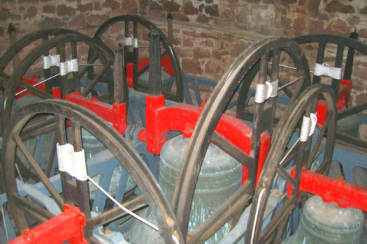
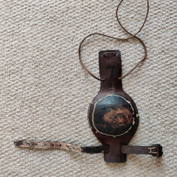
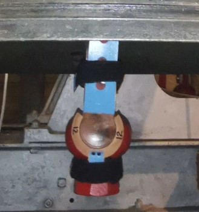
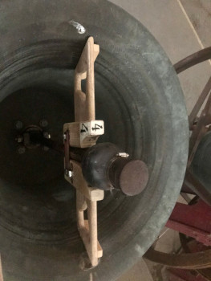
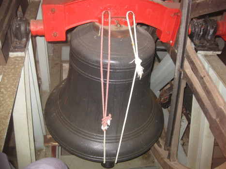
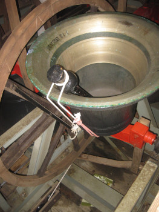
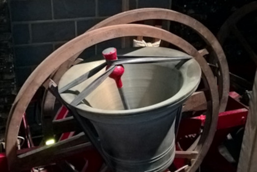

# Bell Chamber


**Site currently under construction**


The bell installation is covered specifically by [Belfy Upkeep](https://belfryupkeep.cccbr.org.uk/docs/010-introduction/). The information here deals with the need for specific items.  


**Ringers are often the only ones with regular access to parts of the church building and have a 'duty of care'. However they are not the people with overall responsibility. Bell chambers should never be visited alone. It is strongly advised that a second person, who is also suitably experienced, is present.**

 
## Muffles  

 

There are two basic types of muffle. The older type is attached by means of leather straps and / or leather thongs. The newer type makes use of Velcro fastening. As muffles are used infrequently, regularly check them for deterioration, do not leave it until they are required. Cable ties may be used to ensure that muffles are firmly fixed, be careful when removing these to not cut the muffles.

Ensure that it is known how to fit these correctly. Muffles should be fitted with the bells down and, as in all cases when work is undertaken in the bell chamber, with a second person present. When not in use muffles should be stored in a fabric bag, ideally hung in the ringing room. They should not be thrown into a cupboard which may be damp and therefore cause deterioration. 

Muffles are, traditionally, used on a limited number of occasions such as funerals, remembrance Sunday, ringing out the old year. On most occasions bells are half-muffled, that is a single muffle is fitted. Traditionally the backstroke is muffled, in which case the muffle sits on the clapper on the side away from where the rope drops when the bell is down. Bells are only rung fully muffled (or deeply muffled i.e. with the backstroke of the tenor unmuffled) for the death of a reigning monarch, the incumbent (Parish Priest), or the Bishop of the Diocese. 

## Silencers

There are various types and means of fitting. 

The above is a wooden tie that holds the clapper in the middle of the bell.

 

The above shows a rope used to tie the clapper It may be preferred to tie the clapper on the hand stroke side so as not to be fine-set for teaching basic bell handling. It may be preferred to tie the clapper centrally if the main objective is simulator work. 

***[ART](../170-glossary/#art)*** recommend one based on an old cycle inner tube. 

## Sound Control

Sound control may be present. This may consist of shutters, trapdoors, etc. Installations are bespoke to the individual towers. It is essential that the method of operation is well documented alongside when it should be used. Further details can be found at [sound control in towers](https://cccbr.org.uk/wp-content/uploads/2021/01/Mike-Banks-noise.pdf).

## Image Credits

| Figure | Details | Source |
| :---: | --- | --- |
| 1 | Modern cast-iron low-side frame at Broadclyst | Photo: James Kirkcaldy |
| 2 | Older muffle with leather thongs and buckle fastenings | Photo: James Kirkcaldy |
| 3 | Modern muffle with velcro fastening at Ripon Cathedral | Photo: CCCBR archive |
| 5 | Solid wooden clapper tie at Washington Cathedral, Washington DC | Photo: CCCBR Archive |
| 6 | Rope clapper tie shown outside bell | Photo: Tony Crabtree |
| 7 | Rope clapper tie shown inside bell  | Photo: Tony Crabtree |
| 8 | ART style clapper tie | Photo: ART |

----


**[Previous Chapter](../ringingroom/)** - **[Next Chapter](../buildingateam/)**


----

## Disclaimer
 
*Whilst every effort has been made to ensure the accuracy of this information, neither contributors nor the Central Council of Church Bell Ringers can accept responsibility for any inaccuracies or for any activities undertaken based on the information provided.*

Version 1.0.0, November 2022

© 2022 Central Council of Church Bell Ringers
