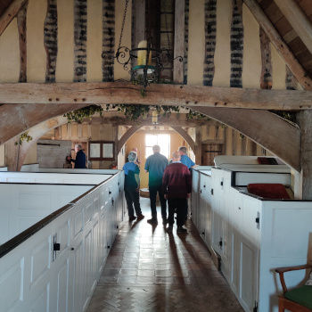
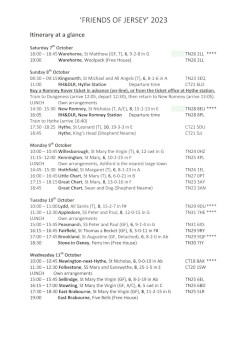

# Organising an Outing

*Figure 1: Outing to Fairfield*

A ringing outing can be an enjoyable and useful way of introducing ringers to a wider variety of bells than they might otherwise encounter. 

It can help those involved to improve bell control and ringing skills, as it is like having multiple practices in one day. 

Most importantly, it is a very good way of getting the ringers together socially. 

Almost all towers are available, as long as the right people are contacted. There may be spectacular buildings and impressive rings of bells which will give lasting memories of the outing. There can be a wide range of access routes, ringing rooms and decoration. 

Outings are usually one day affairs, but they may last a weekend or longer. Similar arrangements are necessary for all.

Anyone can organise an outing if they follow a few simple rules. Take care not to leave anything to chance, and make sure the arrangements are made in good time.

## Planning

### Date

It is important to fix the date as early as possible and to ensure that the participants put this in their diaries and calendars.

Ideally start making the arrangements two to three months in advance. Remember, the responses received may require a rearrangement of the timetable.

### Participants

Consider who will support the outing and who will benefit from the outing.

If a tower outing, always invite any regular visitors. An ideal minimum is twelve people whilst around twenty people is about right.

Consider whether to invite non-ringers, such as friends and relations of the ringers; this may influence the choice of route, the mode of transport and the places to visit.

The towers chosen should be influenced by the experience of the ringers. Ringing on bells which are too difficult for the majority may spoil the day. If there ringers are mainly inexperienced, invite some more experienced ringers along to help. 

### Destination

It is not a good idea to travel half way across the country in a day. This will definitely take the edge off of the most successful outing.

#### Towers

This will depend on the travel distance, the number of towers and the proposed time at each tower. As a rule five towers a day is about right, with a lunch break after two (or three) of these. More towers in a day is feasible, however this will shorten the time spent at each.

**REMEMBER** Too many towers in a day can lead to fatigue and, just like a long return journey home, can take the edge off a successful outing.

#### Timings

Take into consideration any proposed breaks including at the end of the day. 

If there are 20 ringers on the outing aim for at least an hour per tower.

Most places are very welcoming and permit ringing at the times requested, especially if it is about an hour's ringing. N.B. An especially large party may neccesitate a longer time. Consider shorter times when there are fewer bells, people may get fed up with an hour at an unrewarding six; conversely an hour at a decent ten may not be enough. 

Plan around the following:
- If travelling by car, mini-bus or coach a reasonable average speed is 30 mph or less; if cycling allow an average of 6 for mph; if walking allow an average of 2 mph.
- Time to park the transport and get from the transport to the tower and the same to return (around 15 minutes). This is probably when walking or cycling.
- Time to raise the bells and the same to lower the bells (5-10 minutes).
- Time to allow every ringer a reasonable ring.
- Time for comfort and refreshment breaks.
- Possible restrictions in the time of day that towers are available; town centre towers may restrict ringing to after shop opening times, towers near schools may only permit ringing outside of school hours.
- Some flexibility as it may be necessary to reschedule part of the tour dependent on replies. 

### Tower Contacts

Historically, contacts were obtained using paper copies of the local ringing society report or Crockford's Clerical Directory (may be available in a library reference section). Crockford's is produced annually and is available on-line to subscribers. It may still be necessary to use either.

These days, the majority of terrritorial ringing societies publish a means of contact on-line; this may be anonymised e.g. <tower name>@<ringing society>.

Initially, contact the listed tower contact; be aware that they may not be a ringer. If there is no identified contact, try the local ringing society (or branch) secretary who should be able to advise or may possibly make contact on your behalf. 

Few ringers now use paper and pen to make requests but rely instead on telephone or email. Email is to be recommended as it provides a record of the request and replies. N.B. the tower contact may not have an email address in which case telephone or letter may be necessary. If using a letter ensure that a stamped address envelope is enclosed for the reply.

The request should include:
- The full name of the tower that you wish to ring at, this avoids confusion; there may be more than one tower in a particular location or the contact may be responsible for more than one tower.
- The date and timings (start and end) of the proposed visit.
- The name of the group that is requesting to ring; this may be a tower, an established group or a group of friends. It can be useful to include the potential number of ringers.
- The name of the person making the request.

It is advisable to request:
- What the access arrangements are; the meeting place might not be the main entrance to the building.
- If driving, whether there is designated or recommended parking.
- A contact telephone number, ideally a mobile telephone number, as contact might need to be made on the day.
- Whether a toilet is readily available.
- If your visit is to coincide with a refreshment break, local recommendations of venues may be helpful.

### Donations

Decide on the amount to be given, as a donation, to each tower. Some groups give a donation proportionate to the number of bells whilst others give the same amount to all towers. It is an individual decision as to which to adopt.

It may be that towers request a specific donation when they are contacted. Be aware that this might be greater than that which was planned.

It is best to calculate the price per head, and collect that amount, prior to the outing. This reduces the amount of administration on the day. It also allows the right amount to be readily available at each tower.

### Delegate

Once the outing is organised, consider delegating tasks to participants. This might include - producing thank you cards for the towers,  collecting and collating tower donations.

## On Tour

 

*Figures 2 & 3: Tour Guide cover and overview*

### Inform

All those on the outing should be kept informed of the relevant arrangements. A clear, precise and readily available guide is essential. This can be printed (possibly rarer these days) or provided electroncally.

It can be useful, especially when travelling individually, to have mobile contact details of the particpants. It might be useful to set up a communication group using a mobile telephone app, such as WhatsApp. It can be useful if there are any changes on the day e.g. a road blockage.  This will require the participants to opt in.

### Relax

The organiser should be able to enjoy the ringing and relax like any member of the party. 

Consider delgating the organising of the ringing at each tower. A seperate person per tower will spread the workload. It can give people who might not often get the chance, an opportunity to run the ringing. 

**REMEMBER** despite all efforts to ensure a smooth operation, anything that goes wrong is the responsibilty of the organiser.

## Image Credits

| Figure | Details | Source |
| :---: | --- | --- |
| 1 | Outing to Fairfield, Kent | Photo: James Kirkcaldy |
| 2 | Tour guide, front cover | James Kirkcaldy |
| 3 | Tour guide overview | James Kirkcaldy |


**[Return](https://runningatower.cccbr.org.uk/docs/buildingateam/)**


----

## Disclaimer
 
*Whilst every effort has been made to ensure the accuracy of this information, neither contributors nor the Central Council of Church Bell Ringers can accept responsibility for any inaccuracies or for any activities undertaken based on the information provided.*

Version 1.1, October 2023

© 2023 Central Council of Church Bell Ringers
