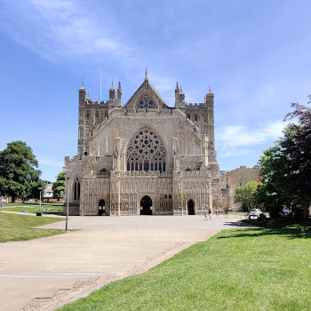
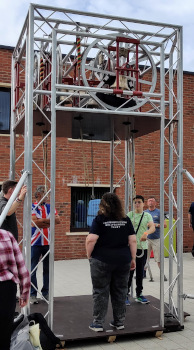
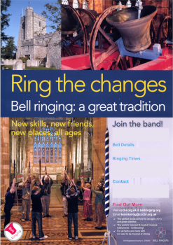
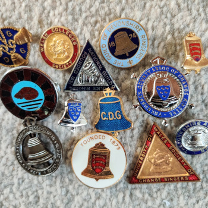
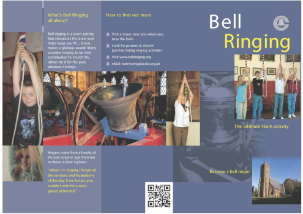

# Communication


**Site currently under construction**


## Liaison with relevant tower authority 

*Figure 1: Heavitree, Devon*

The term ***[tower authority](../glossary/#tower-authority)*** is used to mean the owner(s) and / or person(s) responsible for the bells and the tower in which they are installed.
About 90% of rings of bells, hung for full circle change ringing, are in buildings forming part of the ***[C of E](../glossary/#c-of-e)***. In these cases, the legal ownership of the bells is vested in the Churchwardens. The ***[PCC](../glossary/#pcc)*** has a duty for the use, maintenance and insurance of the bells. It is recommended to have a ringing representative on the PCC. The representative can act as an additional liaison, advising on how ringing is carried out and involving the ringers in important decisions (especially those that may affect ringing).

*Figure 2: Exeter Cathedral, Devon*

Elsewhere, for example in ***[C of E](../glossary/#c-of-e)*** cathedrals, churches of other denominations and other religious buildings worldwide, there are likely to be different lines of authority. 

*Figure 3: Mobile Belfry 2 at CCCBR Roadshow, September 2022*

***[Tower authority](../glossary/#tower-authority)*** also means those owning and / or responsible for rings of bells that are mobile or in secular buildings – e.g. the Local Authority for a municipal ring of bells, or a private owner. 

The CCCBR produce a number of leaflets:

-[From Practice to Perfect](https://cccbr.org.uk/wp-content/uploads/2022/12/From-Practice-to-Perfect-a-short-guide-for-clergy-PCCs-and-Safeguarding-Advisors.pdf) that is aimed at clergy, PCCs and safeguarding advisors. This guide explains how ringers are trained, safeguarded and organised.

-[Bells in your care](https://cccbr.org.uk/wp-content/uploads/2016/05/Bells-in-Your-Care.pdf) which contains notes for incumbents and churchwardens who
find themselves responsible for a ring of church bells.

## Faculties 

These are applicable to bells and towers within the ***[C of E](../glossary/#c-of-e)***. Guidance notes on these should be consulted for any proposed changes within a tower. Further information can be found at [Belfry Upkeep Faculty Rules](https://belfryupkeep.cccbr.org.uk/docs/030-faculty-rules/).

## Contact Details 

*Figure 4: CCCBR sourced notice*

It is useful to display contact details such that they are visible when the building is not open. If regular ringing takes place, include the relevant times. Contact details may be name(s), telephone number(s) and / or e-mail address(es). Whenever contact details are publicised consider: 

- Personal details should be anonymised and GDPR compliant. Use only the details that the contact is prepared to publicise. The contact must give permission. It is better to give the name of their office and not a personal name.

- Use a generic e-mail address e.g., “Tower Name-Bells @ domain name" instead of a personal e-mail address. This anonymises the individual and allows the address to be passed on, should the contact change.

- Provide a mobile telephone number rather than a landline telephone number. The individual may be travelling to the church when contact is attempted, especially when close to a ringing session.

- Keep up to date – review at least annually e.g. at the tower AGM.

## Ringing Societies 

*Figure 5: Sample of ringing society badges*

The body may have the title of Association, Guild, Society, etc. The term ringing society will be used in this document. The ringing society may cover the local area, county, diocese or country. A ringing society would normally have individual ringers as members. It may be that the society has an affiliate membership for other bodies e.g. ***[PCC](./glossary/#PCC)***.
There may be advantages to membership of a ringing society such as: 

- Access to training and development. 

- Access to expertise in tower and belfry inspection. 

- Insurance. 

- Ringing and social meetings, presenting opportunities to meet other ringers with similar experience and age group, this is considered especially important for younger ringers. 

- Ringing at other towers and experiencing different numbers and weights of bells.

- Opportunities to progress an individual's ringing expertise. This may be achieved by the opportunity to ring quarter peals and peals with more experienced ringers.

- Providing a “mentor” to support the development of individuals and of the band.

- Taking committee positions which may help develop individuals. Young people may gain experience for future careers. 

- Ringing societies often have influence with the relevant ***[tower authority](../glossary/#tower-authority)***.

Most ringing societies are affiliated to the ***[CCCBR](../glossary/#cccbr)***. 

## Promotion 

*Figure 6: CCCBR sourced recruitment leaflet*

Consider the use of: 

- Posters outside, or inside, the building. Ensure that these are kept up to date, especially contact details. [Publicity materials are available on the CCCBR website](https://cccbr.org.uk/resources/publicity-material/), this includes downloadable templates.

- Flags, banners and publicity stands. These may be available from a local ringing society.  

- Publicity away from the building, especially where the building is not on a main thoroughfare. 

- Regular updates in the parish magazine, local press, radio, television and social media. [A document on engaging with the press](https://cccbr.org.uk/wp-content/uploads/2022/11/Press-Info.pdf) and [a document on guidance on the use of social media](https://cccbr.org.uk/wp-content/uploads/2020/10/200902-Social_Media_Guidance.pdf) are available on the CCCBR website.

Publicise events when these are not a regular occurrence e.g., striking competitions, ringing for special events. Consider placing these in the parish magazine, on the building website and the building social media account. If extended ringing is to take place, consider posting flyers in the vicinity and through letter boxes of properties within earshot. Be aware that this may lead to strong opposers attempting to get their retailation in first.

For major projects such as the restoration of an installation, including augmentation, separate publicity will be required. This is covered in a separate document [Running a Project](https://belfryprojects.cccbr.org.uk/).

## Image Credits

| Figure | Details | Source |
| :---: | --- | --- |
| 1 | Heavitree, Devon | Photo: James Kirkcaldy |
| 2 | Exeter Cathedral, Devon | Photo: James Kirkcaldy |
| 3 | Mobile Belfry 2 at Nottingham CCCBR Road Show | Photo: James Kirkcaldy |
| 4 | CCCBR porch notice | CCCBR |
| 5 | Various Society badges | Photo: James Kirkcaldy |
| 6 | CCCBR recruitment leaflet page 1 | CCCBR |

----


**[Previous Chapter](../introduction/)** - **[Next Chapter](../formalities/)**


----

## Disclaimer
 
*Whilst every effort has been made to ensure the accuracy of this information, neither contributors nor the Central Council of Church Bell Ringers can accept responsibility for any inaccuracies or for any activities undertaken based on the information provided.*

Version 1.1, December 2022

© 2022 Central Council of Church Bell Ringers
