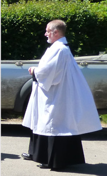

# Finance

## Charges and Fees  

### Weddings 

*Figure 1: Waiting for the wedding party*

In the ***[C of E](../glossary/#c-of-e)***, the fees for wedding ringing are normally set by the ***[PCC](../glossary/#pcc)***, preferably in consultation with the ringers at the AGM. These should reflect whether ringing is: 

- Before and/or after the wedding. 

- The length of time spent ringing. 

- The number of bells to be rung. Some towers charge proportionately.

- Likely travel times and distances of the ringers, etc. 

The couple should be advised that if there is an excessively late start ringing may not continue until that time and may be curtailed after the service. 
Consider setting an end time when ringing will finish, particularly for ringing after a wedding. This gives certainty of the time when ringers can get away and may help when arranging a band. This is especially useful when ringers are required at a few local churches on the same day. 

## Fees for other ringing 

Consider having fixed fees for: 

- Funerals, possibly commensurate with that for weddings.

- Visiting bands.

- Quarter peals. 

- Peals.

These should be determined in consultation with the ***[tower authority](../glossary/#tower-authority)***. When there are no fixed fees it is usual to expect voluntary donations from visiting bands and individuals.

Avoid having a 'box on the wall', especially for downstairs rings, as these may invite theft and damage. 

*Figure 2: Example of church electronic donation point*

The church may consider having an electronic payment system for fees and casual donations. This may involve a commission charge which, although low, reduces the donation received. Within a ***[C of E](../glossary/#c-of-e)*** church implementing this would be the responsibilty of the ***[PCC](../glossary/#pcc)*** and its treasurer. Such a system may allow gift aid to be recovered. It may allow payments for ringing to be captured in an appropriate account. N.B. Consider a request for Gift Aid as this enables income tax to be reclaimed in the case of charities and HMRC registered charitable groups.

## Reimbursement of Expenses 

Arrangements must be made for how the ringers are to receive any such amounts. In the ***[C of E](../glossary/#c-of-e)***, it is likely that a couple getting married will pay the whole cost at one time. The church then arranges the transfer of money to the various recipients. With the current reduction in the use of cash, the church may expect to do this via a bank transfer. 

## Tower Funds 

In the ***[C of E](../glossary/#c-of-e)***, funds are best held within the ***[PCC](../glossary/#pcc)*** account(s) as that is normally a registered charity and registered with HMRC for Gift Aid. This may reduce the expenditure by a third and is a positive for using PCC funds over any tower fund.


**The fund should be identified as a “Restricted Fund” within the PCC accounts; it should NOT be a “Designated Fund” as this could be re-designated by the PCC to other projects.**


This can be achieved by having a covering document listing the restrictions of the funds. If a "restricted fund" there has to be a means of amending the restrictions, a definition of who can do this is essential.

If a tower has funds, separate from the ***[tower authority](../glossary/#authority)***, these should never be held by an individual. Traditionally, such funds have been used for minor repairs and social events for ringers. Such funds are not advisable. If essential, specific treasurer’s accounts are available and may be free from fees. Banks are increasingly reluctant to provide such small accounts.

## Subscriptions

The tower and/or the local society may charge a subscription, typically this is an annual fee. This should be reviewed at the relevant AGM.

## Expenditure 

Agree with the ***[tower authority](../glossary/#tower-authority)***, in advance, who is to pay for replaceable items e.g. ropes. 

If a major project is envisaged the funding of this must be agreed in consultation with the ***[tower authority](../glossary/#tower-authority)***. A separate document, currently under development, will cover the running of a project.

## VAT and the LPW (Listed Places of Worship) VAT recovery scheme 

This only applies to places of worship within the United Kingdom and will be covered in Belfy Projects.

Further details are available on the [LPW scheme website](http://www.lpwscheme.org.uk/).

## Image Credits

| Figure | Details | Source |
| :---: | --- | --- |
| 1 | Vicar waiting for the wedding party | Photo: CCCBR |
| 2 | Electonic donation box at Wistanstow, Cheshire | Photo: James Kirkcaldy |

----


**[Previous Chapter](../formalities/)** - **[Next Chapter](../healthsafety/)**


----

## Disclaimer
 
*Whilst every effort has been made to ensure the accuracy of this information, neither contributors nor the Central Council of Church Bell Ringers can accept responsibility for any inaccuracies or for any activities undertaken based on the information provided.*

Version 1.1, March 2023

© 2023 Central Council of Church Bell Ringers
