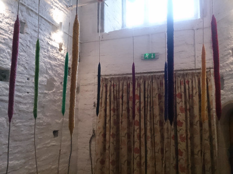
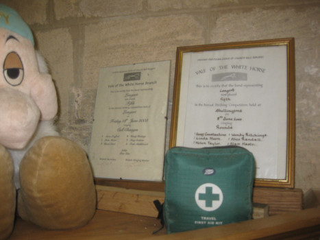
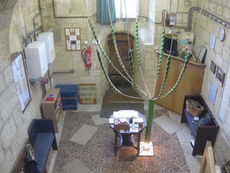
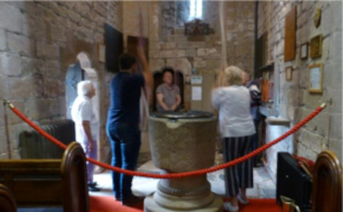

# Health & Safety


**Site currently under construction**


*Figure 1: Ringing chamber at St. Winnow, Cornwall*


A tower is a non-domestic setting, and as such the ***[tower authority](../glossary/#tower-authority)*** has a duty of care over everyone that enters the site or building. If something happens on the site the ***[tower authority](../glossary/#tower-authority)*** is responsible and can be found negligent for everything that goes on within the building. This is why there are a lot more requirements to manage risks, together with their mitigations and documentation. This does not reduce the duty of care on ringers to minimise risk.


Further details can be found in the [health and safety policy advice document (CCCBR)](https://cccbr.org.uk/wp-content/uploads/2021/03/SM_HS_Policies_2021_Ver_1.pdf).

Information specific to working in a bell chamber can be found in [Belfry Upkeep Health & Safety](https://belfryupkeep.cccbr.org.uk/docs/040-health-and-safety/).

All policies must be in-line with the ***[tower authority's](../glossary/#tower-authority)*** policies.

This includes guidance on: 

- Risk Assessments. There are two guides on the CCCBR website:

   - [Tower Safety and Risk Assessment](https://cccbr.org.uk/wp-content/uploads/2020/11/SM_Risk-Assessment_2020_Ver_1.pdf) which provides guidance to ringers on how they can assist their church in the preparation and maintenance of an effective risk assessment for ringing and other activities in the church tower. There is an accompanying [Risk Assessment Template](https://cccbr.org.uk/wp-content/uploads/2020/12/SM_Risk-Assessment_Non-Use_2020_Ver_1.pdf) which may be downloaded, and modified as required, to act as a record of a risk assessment.

   - [Tower Safety and Risk assessment](https://cccbr.org.uk/wp-content/uploads/2020/12/SM_Risk-Assessment_Non-Use_2020_Ver_1.pdf) which provides guidance on what to do in a tower where the bells have not been rung for an extended period.

- Fire precautions, further details can be found at [fire prevention](https://cccbr.org.uk/wp-content/uploads/2020/07/SM_FireRiskAssessment_2020_Ver_1.pdf). 

- Fire safety. 

- Electrical power, lighting and emergency lighting. The inspection and test records, including annual Portable Appliance Testing (PAT) of relevant appliances. Further details on PAT can be found on the [Health and Safety Executive website](https://www.hse.gov.uk/electricity/faq-portable-appliance-testing.htm). Earth bonding testing of the tower and lightning protection should also be carried out by suitably qualified professionals, these would be engaged by the ***[tower authority](../glossary/#tower-authority)***.

- Accidents and illness. An accident and emergency record may be present and must be completed as appropriate.

- Advice for visitors, both ringers and non-ringers. How they are to be supervised, or not e.g. if ringing a peal. This may include induction processes, evacuation practices, turning clapper competence, maintenance records, etc.

Consideration should be given to special occasions such as tower open days when large numbers of people may be present. 
 
Ringing is not risk free. Your first responsibility, as the person in charge, is the safety of the ringers. Consider: 

- If a novice ringer is normally able to handle a bell but still sometimes gets into trouble, nominate an experienced ringer to stand close by to intervene if necessary. 

- Observe how any unknown visitor, who says they can ring, catches hold and if it looks wrong ask them to ring the bell on their own first and stand near in case you need to intervene. 

- Invite any nervous ringers and especially nervous visitors to first ring the bell a couple of times on their own.  

- If you see any signs of physical distress, especially in older ringers, call ‘Stand’ at once. 

- Call ‘Stand’ if there is any significant loss of bell control or other incident.  

- If there are any worrying noises or strange rope movements, first determine whether any bells need to be rung down before investigating. If you don’t know the frame layout and relationship to the entry into the bell chamber, ring all the bells down before investigating. If in any doubt ring the bells down and curtail the session, there is always another session; there may not be a way back from a serious accident. If you think a clapper may have broken, or fallen out, set the bells having first warned the band to set carefully as a slider may have been broken.  

## Attendance Record(s) 

These should be maintained for the purposes of safeguarding and for emergency precautions. The details to be held should be a minimum of name, entrance and exit times (including date). The ***[tower authority](../glossary/#tower-authority)*** may require further details to be logged. 

Towers may wish to have a separate (traditional) visitors' book as an historic record. 

## Additional requirements 

The ***[tower authority](../glossary/#authority)*** may have other requirements and these should be discussed with the authority. These may arise from insurance or other reasons. 

Special precautions may need to be put in place from time to time e.g., the requirements put in place during the Covid-19 pandemic. The ***[CCCBR](../glossary/#cccbr)*** website will normally detail the latest guidance in such cases.

## First Aid Kit 

*Figure 2: Small first aid kit*

Ideally there should be a first aid kit in the ringing room.  

Ensure the location of the first aid kit is indicated, especially if it is elsewhere within the premises. 

Regularly check that all items are within date. The kit should be listed on the ***[tower authority's](../glossary/#tower-authority)*** log of first aid kits together with records of periodic inspections.

## Security 

Further details can be found in the [security for ringers document (CCCCBR)](https://cccbr.org.uk/wp-content/uploads/2020/12/SM_Security_2020_Ver_1.pdf).

A limited number of keys to the building (and internal doors) may be held by the ringers. Consider the number of keys and key holders. There is a balance between security (preventing access) and enabling reasonable access. A single key for each lock is inadvisable, as this may present difficulties at times of sickness or absence. All keys should be registered with the ***[tower authority](../glossary/#tower-authority)***. This may be a condition of the building insurance.

## Tower Access

Further information can be found in [Guidance notes - Tower Access and Stairways (CCCBR)](https://cccbr.org.uk/wp-content/uploads/2019/12/SM_TowerAccess_2019_Ver_2.pdf).

Emergency exits should be clearly indicated and must never be compromised.

Spiders and ropes should ideally be left inaccessible e.g. locked away. This is essential in accessible ringing rooms.  

Turning clappers when bells are up should be avoided in all but exceptional cases, such as heavy bells that are extremely difficult or impossible to rise right-sided. 

Information, for those working on bell installations, is available in [Belfry Upkeep](https://belfryupkeep.cccbr.org.uk/docs/040-health-and-safety/).

Bells should not be left up (raised) for extended periods between ringing sessions, especially where access to the bell and ringing rooms is not secured. This may not apply to heavier rings e.g. where the tenor is over 20cwt. However, in such cases, access must be controlled. Such access should be limited to experienced ringers and trained people.

There is advice on the [Eccclesiatical Insurance Group website](https://www.ecclesiastical.com/documents/bell-ringing.pdf), however this is not written by the ***[CCCBR](../glossary/#cccbr)***. The following summary appeared in the Ringing World:



 If bells are left up at the end of a ringing session then Ecclesiastical Insurance has some guidance on things to consider.
 
- Who might have access to the bells whilst they are up? This might include members of the PCC, clock-winders, telecom aerial maintenance people, visitors on tower tours, etc..
- Are these people aware of the hazards? The PCC might be well-trained on what to look out for and safe paths through the ringing room and bell chamber, but other visitors may not.
- Are all visitors to the tower accompanied by someone familiar with the route and the dangers? Just because someone is deemed competent does not mean that an accident will not occur. Consider the adequacy of the precautions in place.
- What precautions are in place to protect these people?
- Are the ringing room and bell chamber doors securely locked? Are all keyholders known?
- Are warning signs displayed? It can be helpful to have a contact name and number on these for last-minute queries.
- Is there any way of caging in the bell frame, or directing people around the bell frame?
- Is there an alternative route that avoids passing through the bell chamber?
- Are the ropes in the ringing chamber secured whilst the bells are up? A simple padlock on the spider is often sufficient. 
- Are there warning signs advising visitors to not touch the ropes?
- Have safety arrangements been reviewed, reflecting the risks presented? Have necessary precautions been implemented to protect people? Can the risk be removed completely? For example, if the clock-winder comes every Wednesday and has to pass through the bell chamber, ring the bells down after Tuesday practice!


## Other Tower Users 

*Figure 3: Ground floor ringing chamber*

There may be other users of the tower and its internal spaces. These, their access and usage requirements will need consideration. Users may include clock winder(s), flag raiser(s), flower arrangers, creches. Clergy and choirs are often users of ground floor areas and may do so at the same time as ringers.  

*Figure 4: Rope barrier to limit access to ringing area*

Consideration also needs to be given to visitors on open days and the general public, especially in ground floor installations. Ropes at ground floor rings should be raised on a spider. The spider should be inaccesible to the casual visitor by being secured. It is a good idea to place a physical barrier, as in the rope in the above picture, to dissuade non-ringers entering the ringing area whilst rining is in progress.

There may also be persons requiring access to other installations (such as mobile telephone equipment housed in the tower). 

 ## Image Credits

| Figure | Details | Source |
| :---: | --- | --- |
| 1 | Ringing chamber at St Winnow, Cornwall | Photo: James Kirkcaldy |
| 2 | Small first aid kit | Photo: Tony Crabtree |
| 3 | Ground floor ringing room | Photo: Tony Crabtree |
| 4 | Ground floor ringing room with rope barrier | Photo: Alison Hodge |

----


**[Previous Chapter](../finance/)** - **[Next Chapter](../emergency/)**


----

## Disclaimer
 
*Whilst every effort has been made to ensure the accuracy of this information, neither contributors nor the Central Council of Church Bell Ringers can accept responsibility for any inaccuracies or for any activities undertaken based on the information provided.*

Version 1.1, December 2022

© 2022 Central Council of Church Bell Ringers
