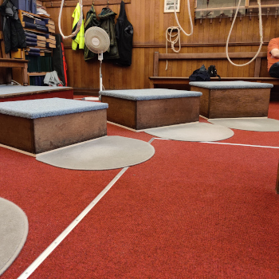
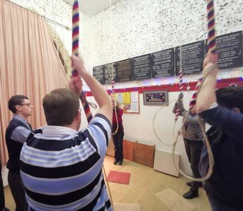
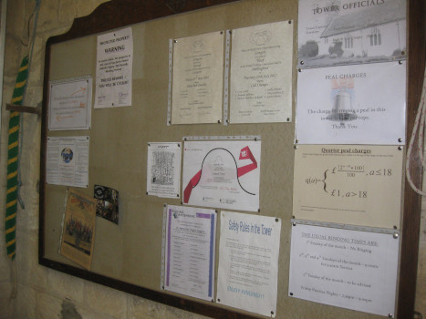
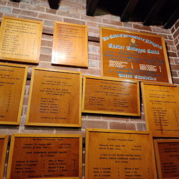
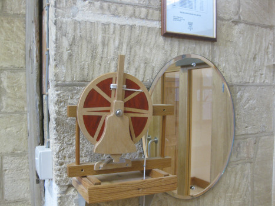
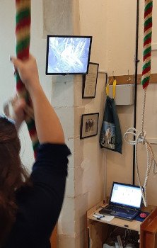
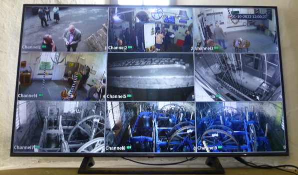

# Ringing Room 


Throughout it should be remembered that any substantive change can only be made with proper consultation with the ***[tower authority](../glossary/#tower-authority)*** and it is their reponsibility to action any such change. In the case of the ***[Church of England](../glossary/#church-of-england)*** a faculty may be necessary. Guidance notes on these should be consulted for any proposed changes within the tower. Further information can be found at [Belfry Upkeep Faculty Rules](https://belfryupkeep.cccbr.org.uk/docs/030-faculty-rules/).
 

*Figure 1: Welcoming ringing chamber*

The ringing room should be kept tidy and welcoming. This reduces risk and gives a good impression to any visitors, especially potential recruits.

The following short videos were prepared by Tom Ridgman, Ely Diocesan Bells Adviser and are hosted on YouTube. We are grateful for permission to reuse this material. The links are:

- [Making ringers welcome and comfortable](https://www.youtube.com/watch?v=a9dBoQGnmOE)

- [Looking after ringing rooms and access](https://www.youtube.com/watch?v=O4R-yfxXvPc)

The CCCBR have produced [Tower environments and their suitability for recruiting and retaining ringers](https://cccbr.org.uk/wp-content/uploads/2021/01/Tower-environment-web-version.pdf) which provides a light but serious look at some key issues.

## Access

This is covered in [health and safety](../healthsafety).

## Boxes 

*Figure 2: Stacked boxes*

Consider whether the boxes:
- are secure and suitable for use. 
- are suitably sized. A ringer should not feel any risk of being too near the edge.
- are carpeted. This allows them to be stacked safely and without sliding for very young ringers. The use of multiple boxes ought to be avoided whenever possible. 
- can be wedged if there are uneven floors.

Further details are available at [notes on ringing boxes (CCCBR)](https://cccbr.org.uk/wp-content/uploads/2021/06/SM_Ringing_Boxes_2020_Ver_1_1.pdf). This document details how to make a 2ft x 2ft box which is stackable. "Fixed" boxes at towers e.g. Exeter (see picture below) are typically larger. The height generally needs to increase and be roughly in a ratio of 0.5-0.6 to the width. There are Health and Safety implications of high (fixed) boxes, but there are also positive sides to them.

Positive reasons for using boxes:
- Reduced rope wear, as the rope goes into compression (this induces fibre slip and wearing out) when it meets a solid surface.
- Reduces the risk of a trip hazard from the tail end coiling up around or under the ringer's feet.

Negative reasons for using boxes: 
- Need to consider the need for edge protection. Boxes up to 600mm height do not need to have edge protection, in accordance with HSE guidance on unguarded edges,.
- A learner may be at risk of falling off/ver when told to move away on losing control of the rope. 

Consider whether a box for a heavy bell should be fixed or not. Fixed boxes may become used as storage space. If this is the case consider what goes in them. It is not a good place to store the first aid kit.

## Carpets and Rope Mats

*Figure 3: Modern carpet, mats and boxes:*

These should be fit for purpose. They are especially important on stone floors. Try to avoid walking on rope mats as any grit or mud on shoes may be as damaging as the floor. Both carpets and rope mats should be kept clean.

Ideally, mats should not overlap as this introduces a trip hazard.

Rope mats can be obtained from carpet suppliers as offcuts or from old pattern books.

There is a commonly held belief that wool is better, however this anecdotal. Most rope wear is a result of the compression when the rope comes into contact with another surface.

## Ceiling, Rope Guides,  Spiders 

*Figure 4: Rope guide for twelve bells*

Consider whether the rope bosses are at the optimum height. If too high the ropes can be flighty. If too low the sallies can “jump” when coming down at backstroke. The ideal height is typically such that the sally of the lightest bell just reachs the guide whilst that of the heaviest bell does not go completely through. It may be neccesary in very heavy rings to have guides at different heights for the lighter and heavier bells.

Ceiling boss material and the contact surface area has a huge effect on how a bell rope wears out.  Cast iron generally corrodes and becomes abrasive to ropes, generally wearing the rope immediately above the sally. A dense timber may be better as it holds a polish and does not abrade the ropes. If unsure, seek expert advice, from your Society, ***[CCCBR](../glossary/#cccbr)***, or a professional bell hanger. 

If the rope circle is poor or very unequally spaced, consider seeking advice as above, especially when there are ropes very close together.  

## Chiming Apparatus 

 

*Figure 5 (left): Ellacombe chiming apparatus. Figure 6 (right): Electronic control unit and spider control*

This includes Ellacombe apparatus, chiming hammers, clock hammers and electronic units (e.g., Apollo and similar). 
Ensure that these are correctly set before ringing, especially when the apparatus is not in the ringing room. A warning notice should be prominently displayed. This should include advice on how to setand check the setting of the apparatus. 
The picture on the left shows an ellacombe apparatus and the picture on the right shows the controls for the operation of an electronic unit (alongside controls for an electrically operated spider).

## Coat Hooks 

Consider whether these are fit for purpose and are in suitable locations. Ensure that coat hooks do not lead to important items being hidden such as emergency equipment, light switches, clock hammers. Ensure that these do not impinge on a ringer's position. The use of free standing coat stands should be discouraged as these can be dislodged or caught by flying ropes.

## Curtains / blinds 

These are primarily to prevent ringers being blinded by sunlight. Heavy curtains may also be an effective way to shut off an open staircase, door way or open gallery.  They may assist in enabling the ringing room to be heated without heating other unused areas such as the rest of the building, staircase, etc.
Curtains can also serve to deaden excessive echo in a ringing room.

## Electrical Devices 

Power points and powered devices should be checked by a professional, approved by the ***[tower authority](../glossary/#tower-authority)***. Any portable electrical equipment should be subject to regular checks. Devices must be included in the ***[tower authority's](../glossary/#tower-authority)*** register of electrical equipment. If there are too few power points, then additional points should be installed rather than using extension leads and adaptors. Do not daisy chain from one socket.

## Heating

Consider arrangements to make the environment comfortable. In summer this may include adequate ventilation. In winter this may include heating. If heating is present this must be with the approval of the ***[tower authority](../glossary/#tower-authority)***. Free standing heaters should not be used.
If the ringing room is open to the rest of the building it is worth investigating the use of screens or curtains to enclose the area.

## Lighting 

*Figure 7: Well lit ringing chamber*

Further details can be found at [lighting in and around towers (CCCBR)](https://cccbr.org.uk/wp-content/uploads/2020/02/SM_Lighting_2019_Ver_3.pdf).  

In the ringing room:

- Consider the placing of the lighting. Ideally the lighting should be placed centrally to the rope circle; this will illuminate the ringers from both above and the front. Ensure there is enough light within the rope circle and not just around the walls. Uplighters may look good, but the reflectivity of the ringing room may mean they do not work. Uplighters require more energy to achieve an acceptable light level and work best when combined with downlighters, lighting the space at eye level (approximately 6 foot) to waist level (approximately 3 foot) for the ringers.

- ensure that there at least two light sources. This provides a back-up should one fail or is smashed by a wild rope. If in doubt, fit more lights than originally considered. Ideally engage a professional to help with design. 400-500 lumen at eye level (approximately 6 foot from the floor) is a good starting point when ringing. 

- Lighting needs to be maintained, e.g. bulbs changed, therefore the light fittings should be safely accessible.

- There should be a battery back-up to protect against a blown fuse or power failure in at least one light fitting. The lighting should be 'safety lighting' not 'exit lighting'. The former is brighter. There is further information at [Oxford Diocesan Guild website emergency lighting](https://odg.org.uk/wordpress/wp-content/uploads/2020/01/tbc01_emergency_lighting-3.pdf). N.B. This document is to be updated.

If the ringing room has large windows consider some means of reducing direct sunlight which may temporarily blind the ringers e.g. curtains or blinds. 

## Notices Boards and Information 

*Figure 8: Notice board*

Ensure that notice board(s) display up-to-date information, such as tower and Society notices. There is little point in displaying details of past events.  

## Ringing Records

### Visitor book

Tower records of visitors, quarter peals and peals. Within churches in the Church of England, these are formally part of the Parish records. Further information can be 
found in the History and Archive work group pages.

*Figure 9: Visitor's book* 

A band may wish to maintain a visitor's book. This can offer information on who has visited in the past when researching.

### Peal boards

*Figure 10: Selection of peal boards*

Peal and other commemorative boards, certificates and photographs. Are these recorded elsewhere? It is a good idea to maintain a quality photographic record of these in a separate location. There are persons who do produce boards to order, there details are often advertised in the Ringing World and on social media. Putting up a board in a tower requires consultation with the tower authority and an Archdeacons’ consultation in a ***[Church of England](../glossary/#church-of-england)*** church.

Older peal boards may require restoration. There are specialist firms providing such services, they can be found by a search of the internet or through the Ringing World.

### Trophies 

*Figure 11: Selection of ringing trophies*

These are the usually the property of the awarding body. However, they are in the care of the tower and should be kept securely. Insurance of these items is normally the responsibility of the awarding body.

## Ropes  

See information in the [rope section of Belfry Upkeep](https://belfryupkeep.cccbr.org.uk/docs/120-ropes/).

Adjusting tail end length. N.B. In the West Country, especially Call Change towers, the adjustment of ropes may not be permitted. This may take two forms:
- Untucking and tucking the tail end. This is acceptable, provided it is done carefully, using a spike or fid, to separate the strands. This should not be done for every touch
- Tying a knot, usually a ‘Figure-eight’ knot, to shorten a long rope. This is a short-term measure and is normally acceptable as the knot is removed after use.

It is a good idea to have a few usable spares to cover any bell, as needed. Natural fibre ropes degrade whether in use or not. Ropes kept in a box may appear to be in good condition, but the fibres will have decayed whilst not used. Ropes should be stored so as to prevent attack by vermin. Each rope should be labelled to indicate which bell(s) it is for.

If there is not at least one person able, and willing, to check the ropes at suitable intervals than a local society 'expert' may be able to assist. If a person is available locally, they should be able to identify and correct any wear points, change or repair a rope if needed. If ropes do need professional maintenance or replacement there are a number of manufacturers. Their details are often advertised in the Ringing World and on social media.

If unsure, consider contacting your local Society or the ***[CCCBR](../glossary/#cccbr)***.

## Seating 

Seating may consist of chairs, benches, etc. They should be free of obstacles that may be picked up by a rope whilst ringing. Ideally, they should be enough away from the ropes to prevent a moving rope hooking them. A carefully designed stack of boxes may provide additional seating when the boxes are not in use.
Consider whether there is adequate seating to accommodate people not ringing. The size of the tower may restrict the amount of seating.

Always consider whether the seating is fit for purpose. 

## Storage  

Consider whether storage spaces need to be lockable. This is especially important when the ringing room is readily accessible. It may also be necessary to lock any higher value items away.

## Tools 

*Figure 12: Collection of tools suitable for bell installations*

These should be usable and not simply rusted away. It may be preferable for the Steeple Keeper (or person doing maintenance) to provide their own tools. Tower tools may have a habit of “walking” or being misused, even by well-intentioned people!

## Teaching aids and a suitable space for teaching. 

This may include model bell(s), simulator(s), books and pictures of the bells above. The latter may include CCTV as explained below. Information on teaching ringing is available on the [ART webpages](https://ringingteachers.org/).

The following is a list of possible assets, though not exhaustive. In all cases consider whether these are kept securely and are adequately insured for loss or damage.  

### Display bell(s) 

*Figure 13: Model demonstration bell*

If possible, a model bell should be portable allowing its use for demonstrations outside of the tower.  

### Handbells

*Figure 14: Set of handbells in carrying cases*

If these are not usable, consider restoration otherwise they are merely a display item.

If handbells are considered a useful resource a cheap option is a set of eight “rainbow” handbells. These are readily available, inexpensive, robust and ideal for teaching place-counting, etc. 

### Simulators

*Figure 15: Simulator installation in ringing room*

All components should be kept securely and the electrical components must have been PAT tested by an approved contractor.
Any fixed wiring needs to be inspected every couple of years by a qualified electrician. Any fixed wiring should also have been installed by an electrician to BS7671. This generally covers circuits up to sockets, anything plugged into a socket is portable appliance.

## The Ringing Experience 

The [Volunteer and Leadership work group](https://cccbr.org.uk/about/workgroups/volunteer-and-leadership/) pages should also be consulted.

### Sound 

Consider the sound levels in the ringing room good. If it is too echoey, consider a carpet or large rug may reduce this. Curtains and soft furnishings may also help.  If the bells “shout” down through a trap door, or through the stair door, some form of insulation may reduce or redress the matter.

Consider the external acoustics. The bells may cause annoyance to neighbours if especially loud. There may be a professional means of reducing this.

Further advice may be available from your local Society or the ***[CCCBR](../glossary/#cccbr)***. If the problem is larger then consult a professional. There is further information at [sound control (CCCBR)](https://cccbr.org.uk/wp-content/uploads/2021/01/Mike-Banks-noise.pdf).

## Other areas to consider 

### CCTV

*Figure 16: CCTV display in ringing room*

This may cover multiple areas. Images of the ringing room and bell chamber are useful for visitors who may not be able to access the tower. Images of the bell chamber are useful for learners. Images of other areas in and around the building may provide additional security, etc.

### Communication

Links to the body of the building, especially where the ringing room is separate, need to be considered. The answer may be as simple as a bell pull or as complex as a telephone/visual communication system. This can assist with timings for events (especially weddings at churches) and other activities within the building.  

### Kitchen

This may consist of a kettle, mugs and a means of taking the latter away for cleaning. These must be compliant with hygiene requirements. There may be restricted access when this is the main part of the building.  

### Toilet(s) 

As these may be in the main part of the building access may be restricted.

### Parking

There may be accessible parking as part of the premises although access is probably, restricted especially at times when events (including church services). In town settings it may be worthwhile publicising where the nearest accessible parking can be found.

## Image Credits

| Figure | Details | Source |
| :---: | --- | --- |
| 1 | Ringing room at St Machar, Aberdeen | Photo: CCCBR archive |
| 2 | Pile of carpeted boxes |  Photo: Tony Crabtree |
| 3 | Carpets, mats and boxes at Exeter Cathedral | Photo: James Kirkcaldy |
| 4 | Rope Guide frame at Melbourne, Derbyshire | Photo: James Kirkcaldy |
| 5 | Ellacombe chiming apparatus | Photo: James Kirkcaldy |
| 6 | Electronic control unit and spider control at Exeter Cathedral | Photo: James Kirkcaldy |
| 7 | Well lit ringing room at Great Barton, Suffolk | Photo: CCCBR archive |
| 8 | Notice board | Photo: Tony Crabtree |
| 9 | Visitor's book | Photo: Tony Crabtree |
| 10 | Peal boards at St Mark, Exeter | Photo: James Kirkcaldy |
| 11 | Competition trophies at Exeter Cathedral | Photo: James Kirkcaldy |
| 12 | Collection of tools suitable for use on a bell installation | Photo: Tony Crabtree |
| 13 | Model demonstration bell | Photo: Tony Crabtree |
| 14 | Set of fourteen handbells in carrying cases | Photo: James Kirkcaldy |
| 15 | Using the simulator at Great Gransden, Cambridgeshire | Photo: CCCBR archive |
| 16 | Multiple channel CCTV at Ledbury, Herefordshire| Photo: Alison Hodge |

----


**[Previous Chapter](../emergency/)** - **[Next Chapter](../bellchamber/)**


----

## Disclaimer
 
*Whilst every effort has been made to ensure the accuracy of this information, neither contributors nor the Central Council of Church Bell Ringers can accept responsibility for any inaccuracies or for any activities undertaken based on the information provided.*

Version 1.1, March 2023

© 2023 Central Council of Church Bell Ringers
