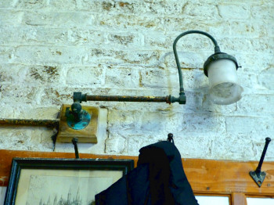
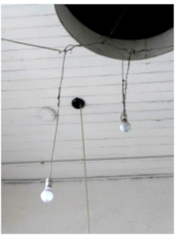
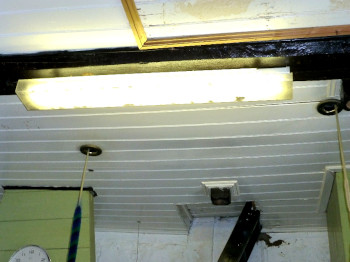
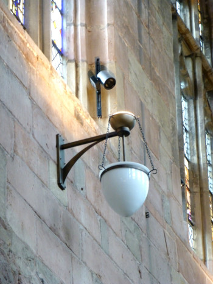
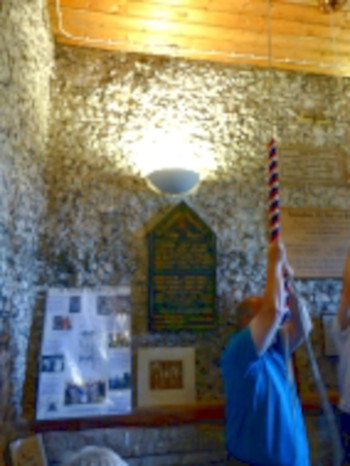
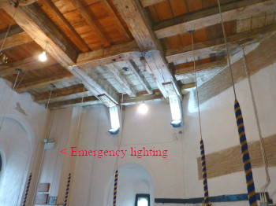

# Lighting

In and around towers.

The following was previously published as a .pdf file on the ***[CCCBR](https://runningatower.cccbr.org.uk/docs/glossary/#CCCBR)*** website.

*Figure 1: Is this the state of the art in your tower? This old gas lamp would be better conserved properly
for its engineering heritage value*

## Introduction

Lighting in and around a tower is often taken for granted until it is not working!

As a consequence of significant technical developments in lighting in the last few years, most people now benefit from good quality artificial light in their domestic, leisure and professional environments.

Buildings containing rings of bells too are exploiting new fixtures and fittings to reduce power consumption. While making the lighting more efficient, appropriately designed modern units should also enhance the effectiveness of the lighting.

Towers, however, are not always included in improvement schemes and, in some cases, installations have not recognised the specific needs of ringers for ringing. Traditional tungsten filament bulbs have been phased out so this note aims to offer some basic advice for steeple keepers and ringers. A few specific considerations and options will be presented as a guide. As is typical in ringing, every tower and part of a tower has to be considered on a case by case basis as the situations are so varied.


Caution – It is essential that specialist advice and qualified contractors are used in any major work on electrical lighting. The ***[tower authority](https://runningatower.cccbr.org.uk/docs/glossary/#tower-authority)*** should also be involved; in a church setting, a faculty may be required for more significant modifications to lighting as part of the electrical installations.


In this short note, suggestions are offered for lighting in (and around) the tower that are suitable for routine ringing. Additional comments are added as guidance for work such as maintenance in and around the tower.

*Figure 2: Tangles of wires with suspended bulbs are not a safe arrangement!*

## The Ringing Room

There are several factors that need to be considered in a ringing room. If the same space is not used only by ringers, then it may even be necessary to have separate switched systems for the different users.

### The Basic Fittings

There is now a huge range of very stylish light fittings available and they are being developed rapidly.

Modern fittings can be very compact and it should be possible to find a style that is suitable for most locations. In towers, professional quality lighting is more appropriate than domestic, as it should be. Professional quality should offer more rugged and durable while still aesthetically attractive. 

Professional quality fittings are also designed specifically to offer good quality uniform light, with standard replaceable lamps. Whatever is chosen should also be compatible with the historic fabric in which it is being installed.

Light fixtures must not hinder rope movement either during normal ringing, on breaking or potentially when ropes lash about during teaching. Professional designs tend to not have protruding arms or other features that could be hazardous.

Modern LEDs (light emitting diodes) do not get hot and luminaires fitted with LEDs should be used in any new installation or upgrade. LEDs have largely eliminated the traditional risk of lamps becoming hot and hence a fire risk, especially when left on for 3 or more hours.

### Intensity and Glare

Lighting intensity needs to be similar to daylight or that created in a normal domestic or offic environment, and preferably uniform across the space, without strong reflections that may dazzle ringers. It is difficult to specify as the apparent illumination will depend on several factors. The light intensity perceived by the human eye depends on wavelength of the source and the illumination will depend markedly on the size of the space, surface finish, colour and reflectivity of wall coverings, furniture, windows, etc..

### Position

More critical than lighting intensity, is the position and direction of the lights. Since all ringers will be looking across and around a ringing room during ringing, the fittings must all be well above normal sight lines to avoid dazzle and discomfort. (The sun causes similar problems in some towers with windows; adjustable curtains or blinds are essential at some times of the day and year. In rare instances, even external floodlights have been known to aggravate the ringers!)

How lamps are to be replaced must be planned prior to finalising the selection of the installation. 

Lighting should be installed, if at all possible, so that scaffolding or ladders will not be required for lamp replacement.

*Figure 3: Typical strip light diffuser with some debris building up*

### Shading

The light must be diffuse; depending on the source, diffusers may be required to minimise glare. Many modern sources are much more intense and directional than traditional bulbs so care is required when installing new fittings at the same location as a previous lamp. The style of shade also requires careful selection. If dust, insects, spiders or other debris can easily collect in a shade or diffuser, this will soon reduce the light efficiency, even if not posing a fire hazard as would have occurred with traditional tungsten filament bulbs. Ringers should not be expected to clean out lamp shades at frequent intervals.

*Figure 4: Up and Down combined fitting*

This picture shows an installation in the body of a building - a dual fitting with uplighter and down-lighter and, adjacent to this, a spot light. This arrangement enables different lighting effects for different functions in the building. However, this would not be suitable in a ringing room. The challenge here is that scaffolding is required for every lamp change, and
debris is building up in some of the globes. No doubt, dust will also be settling on the uplighters and hence reducing their efficacy.

*Figure 5: Uplighter*

This picture shows an uplighter giving a good light out of the way of ropes and ringers. Inevitably, it may still collect debris.

### Flicker

A strongly visible flickering (i.e. a few per second, as for example, in a strip light) probably indicates a fault. A more rapid flicking (several tens per second) may be a consequence of the operation of the electrical system and may cause a stroboscopic effect associated with the movement of striped sallies.

Some people are more sensitive to this than others so it is difficult to set a specification. Specialist advice may be required and specifications for contractors should mention the movement of striped “sallies” on the ropes used in bell ringing.

### Switches

Their position and function need careful thought. One switch, for example at the bottom of the tower, may simply operate all the lights thus avoiding some lights being left on, as can arise with several switches. However, this simplicity can also mean that ringers could be plunged into darkness inadvertently.

Two way switches on the stairs (I.e. the same function achieved at both the top and bottom), plus a separate switch for the ringing room is probably the optimum for many situations (as conventional in a 2 storey house).

### The Bell Chamber

Lighting in the bell chamber is also covered in [Lighting and electrical equipment](https://belfryupkeep.cccbr.org.uk/docs/040-health-and-safety/#lighting_and_electrical_equipment) in 'Belfry Upkeep'.

Often a very neglected ‘black hole’, bell chambers do need excellent lighting as they typically have little natural light even during daylight hours.

A good quality room light is a basic requirement, but it will not be possible to position a single lamp to enable people undertaking maintenance activities to see their way over, under and around the bells and frame. Several lights should be installed - the light fixtures and fittings should be robust, remembering that work in the bell chamber is likely to involve use of bulky tools and shifting of awkward, large and very heavy items. Water and insect/vermin protection should also be considered; mice and squirrels have a propensity to chew cables! While it is best to keep vermin out of towers, when there is a known problem cables should be installed in metal conduit or trunking, or metal clad cables used.

Lighting circuits are not adequate for modern power tools deployed for maintenance work; separate power circuits are therefore essential for heavy duty power tools and lifting gear, and to provide supplementary lighting from additional movable lamp stands and hand-lamps repositioned when required.

People working in a bell chamber, may well now use supplementary battery operated lamps, as these provide excellent illumination where required, for extended periods of time and in compact format.

Head torches are particularly useful.

## Stairs

Even if there are some windows on the staircase, good lighting is essential on staircases. Compact and flexible systems are now available, such as LED light ropes, that provide excellent lighting in comparison with traditional lamps. As advised repeatedly, care should be taken to purchase and install good quality products. Fixing requires careful planning to provide the light, without risk of damage or breakage and without impeding people or equipment/tools and other things being carried up and down what is often a tight space. In particular, many staircases are tight for space and installers should ensure that lamps are not positioned so that they could be knocked or even used as hand holds!

## Intermediate Rooms

Lighting in such spaces will depend on usage. The major consideration for ringers is that the light fittings must not impede the rope travel either during normal ringing nor during any accidental atypical rope movement as could occur if a rope breaks.

## External Approaches, Car Parks, etc.

Lighting for these areas should be included as an integral part of the installations in and around the building. Entrances to towers, however, may be very different from the main routes used by the majority of users so may require separate ighting from the principal routes. They are often overlooked!

## Emergency Lighting

### Lighting Failure

Failure may be due to accidental operation of a switch, power failure or lamp failure. These 3 causes need to be addressed separately. Lamp positions should take into account the risks of any one lamp failing; i.e. any space must not be totally dependent on a single bulb. Switch positions can minimise the power being turned off accidentally, but power failure requires a separate emergency power supply that would last for an appropriate length of time, normally 1 or 3 hours.

### Emergency Systems

*Figure 6: Tower with lamps, uplighters and emergency lighting (indicated).*

This should be integrated with the building system in case of power cuts. Ideally, the lighting is integrated with the emergency exit signage. The light source is usually a low power consumption lamp run from rechargeable batteries. Integrated emergency lighting is normally installed with fire/heat-proof cable (technically MICC/MICV or FP200 / FP400). If not integrated with the building system, then a separate system may be purchased and installed relatively economically and safely. While most people using the building may expect to leave in the event of an extended power failure, ringers may (if safe otherwise to do so) wish to continue ringing for up to 45 minutes or even the greater part of 3 hours! Whatever
approach is adopted, the system must be tested periodically and test records retained.

A good quality, rechargeable torch is an asset in any tower, as long as it is kept fully charged and could be retrieved (even by visitors who may not know the tower) in total darkness.

Note that there is a relevant British Standard - Emergency lighting. Code of practice for the emergency escape lighting of premises BS 5266-1 – the current version (issued May 2016) is available from the Health and Safety Executive website but cost £264 in December 2019.

| Figure | Details | Source |
| :---: | --- | --- |
| 1 | Old gas fFitting | Photo: CCCBR |
| 2 | Tangle of fittings | Photo: CCCBR |
| 3 | Diffused strip light | Photo: CCCBR |
| 4 | Combination uplighter and downlighter | Photo: CCCBR |
| 5 | Uplighter | Photo: CCCBR |
| 6 | Lamps, uplighters and emergency lighting | Photo: CCCBR |


**[Return](https://runningatower.cccbr.org.uk/docs/ringingroom/)**


----

## Disclaimer
 
*Whilst every effort has been made to ensure the accuracy of this information, neither contributors nor the Central Council of Church Bell Ringers can accept responsibility for any inaccuracies or for any activities undertaken based on the information provided.* 

Version 1.1, March 2023

© 2023 Central Council of Church Bell Ringers
